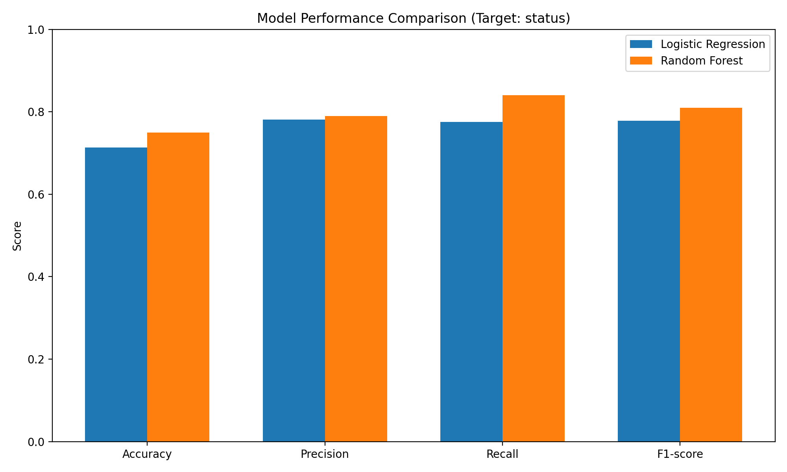

# Model Performance Comparison  

Target Variable: `status` (Startup Success)

This report compares the performance of two models developed by the team:
- **Logistic Regression** (Cathy)
- **Random Forest** (Lan)

The goal is to predict whether a startup becomes successful (`status = 1`).  
Since this is the positive class, we focus primarily on **precision**, **recall**, and **F1-score for class 1**, alongside overall accuracy.

## 1. Review of the Models:
### 1.1 Logistic Regression:
- Logistic Regression with scaled continuous features
- Implemented using a preprocessing + model Pipeline
- Used `StandardScaler` for continuous variables
- Set `max_iter=1000` to ensure convergence
- A 5-fold cross-valildation is done (though not used in comparison)

### 1.2 Random Forest:
- Random Forest classifier with default tree-based preprocessing
- No feature scaling required for model performance
- Trained using the same cleaned train/test split
- Captures non-linear patterns and feature interactions

---

## 2. Performance Metrics (Class 1: Success)

### 2.1 Confusion Matrix
For Logistic Regression:

For Random Forest:

### 2.2 Mrtrics comparison
Based on the confusion matrices, the following metrices are calculated:
- Accuracy: percentage of correct predictions
- Precision: when model predicts success, how often is it correct (true positives/predicted positives)
- Recall: how many real success did model catch (true positives/actual positives)
- F1-score: balance of precision and recall

| Metric      | Logistic Regression | Random Forest |
|-------------|---------------------|----------------|
| **Precision (1)** | 0.782 | 0.790 |
| **Recall (1)**    | 0.775 | 0.840 |
| **F1-score (1)**  | 0.778 | 0.810 |
| **Accuracy**      | 0.714 | 0.750 |

---

## 3. Visual Comparison

A bar chart comparing the Accuracy, Precision, Recall, and F1-score of both models:

---

## 4. Insights & Interpretation

### **Random Forest performs better overall.**
- It achieves a **higheer recall (0.84)**, meaning it identifies more true successful startups.
- It also achieves a higher **F1-score (0.81)**, indicating a better balance between precision and recall.
- The overall **accuracy** is also slightly higher (0.75 vs. 0.714).

### **Logistic Regression performs decently but misses more successful startups.**
- Precision is similar (0.782 vs. 0.790), meaning both models are similarly reliable when predicting success.
- However, LR has **lower recall (0.775)**, capturing fewer actual successful cases.
- As a result, its F1-score is lower.

---

## 5. Top features
Both models list their top features of importance:

### Logistic Regression:
Top positive features (increase success probability):
| Feature                     | Coefficient |
|-----------------------------|-------------|
| has_roundD                  | 0.866       |
| is_top500                   | 0.760       |
| milestones                  | 0.715       |
| is_MA                       | 0.675       |
| is_biotech                  | 0.564       |
| is_enterprise               | 0.457       |
| is_NY                       | 0.415       |
| avg_participants            | 0.316       |
| has_roundC                  | 0.249       |
| age_first_milestone_year    | 0.229       |

Top negative features (decrease success probability):
| Feature                     | Coefficient |
|-----------------------------|-------------|
| is_web                      | -0.055      |
| is_mobile                   | -0.139      |
| age_first_funding_year      | -0.172      |
| is_otherstate               | -0.194      |
| has_angel                   | -0.208      |
| is_gamesvideo               | -0.212      |
| is_consulting               | -0.242      |
| has_VC                      | -0.248      |
| is_TX                       | -0.273      |
| is_ecommerce                | -0.738      |

### Random Forest

### Any insights?
- Both models agree that funding history (rounds, participants, milestones) is highly predictive of success.
- Logistic Regression highlights specific categorical indicators (e.g., top500, enterprise, biotech, NY/MA).
- Random Forest emphasizes funding magnitude and timing more heavily, and captures complex relationships LR cannot.

---

## 6. Conclusion

Based on F1-score, recall, and overall accuracy,  
**Random Forest is the stronger model for predicting startup success.**

It should be preferred if the goal is maximizing correct identification of successful startups.

Logistic Regression remains useful for interpretability and coefficient analysis, but Random Forest provides better predictive performance for this task.